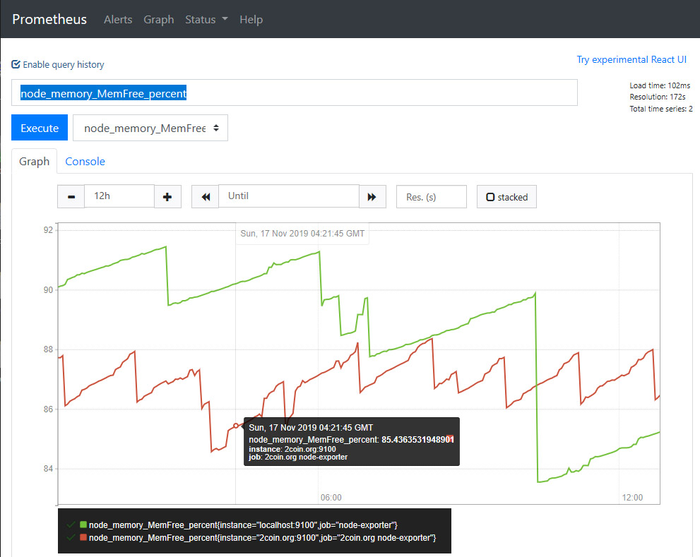
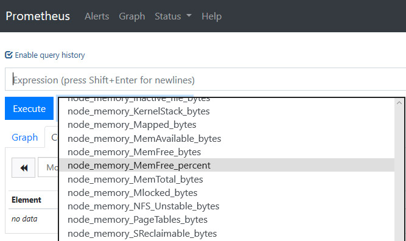
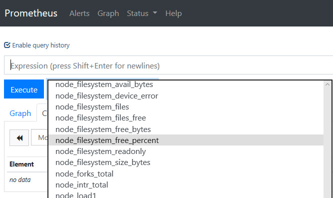

# Prometheus Alerting and Monitoring

[Prometheus Alerting and Monitoring](https://www.udemy.com/course/prometheus/)

## Install Prometheus

```bash
sudo apt update
sudo apt install prometheus
```

This will have installed 2 services being Prometheus and the Prometheus Node Exporter. You can verify there status using the commands. (Press Ctrl-C to exit the status log)

```bash
sudo service prometheus status
sudo service prometheus-node-exporter status
```

Prometheus should now be running.

You can visit it at http://[your IP address]:9090

The installation also created a user called Prometheus. You can see which processes it is running by using the command

```bash
ps -aux | grep prometheus
```

- IP Address: 137.184.226.152
- URL: https://prometheus.domhallan-devops.com/

Since I have already set up the domain name, I can get a free certificate using Certbot.

Certbot will install a LetsEncrypt SSL certificate for free.

Ensure your domain name has propagated before running CertBot.

Your domain and IP will be different from mine, and note that it may take some time for the DNS record to propagate across the internet.

On my server, I will run

```bash
sudo snap install core; sudo snap refresh core
sudo snap install --classic certbot
sudo ln -s /snap/bin/certbot /usr/bin/certbot
```

Now we can run CertBot.

```bash
sudo certbot --nginx
```

Follow the prompts and select the domain name I want to secure.

Next open the Nginx Prometheus config file we created earlier to see the changes.

```bash
sudo nano /etc/nginx/sites-enabled/prometheus
```


Tool for looking up `cname` information: https://mxtoolbox.com/CnameLookup.aspx

Save and test the new configuration has no errors

Restart Nginx with:

```bash
nginx -t
sudo service nginx restart
sudo service nginx status
```

Test it by visiting again: [My Prometheus Instance](https://prometheus.domhallan-devops.com/)

Visiting your [IP address](137.184.226.152) directly will still show the default Nginx welcome page. If you don't want this to happen, then you can delete its configuration using the command below.

```bash
rm /etc/nginx/sites-enabled/default
```

You can also generate the CSR with [CSR Generator](https://decoder.link/csr_generator). This a myriad of tools like SSL Checker, CSR Decoder, etc.

Next open the Nginx Prometheus config file we created earlier to see the changes.

```bash
sudo nano /etc/nginx/sites-enabled/prometheus
```

Everything is great so far, but anybody in the world with the internet access and the URL can visit my Prometheus server and see my data.

To solve this problem, we will add user authentication.

We will use Basic Authentication.

SSH onto your server and CD into your /etc/nginx folder.

```bash
cd /etc/nginx
sudo apt install apache2-utils
```

Now we can create a password file. In the command below, I am creating a user called 'admin'.

```bash
htpasswd -c /etc/nginx/.htpasswd admin
```

I then enter a password for the user.

Next open the Nginx Prometheus config file we created.

```bash
sudo nano /etc/nginx/sites-enabled/prometheus
```

And add the two authentication properties in the examples below to the existing Nginx configuration file we have already created.

```nginx
server {
    ...

    #additional authentication properties
    auth_basic  "Protected Area";
    auth_basic_user_file /etc/nginx/.htpasswd;

    location / {
        proxy_pass           http://localhost:9090/;
    }

    ...
}
```

Save and test the new configuration has no errors

```bash
nginx -t
```

Restart Nginx

```bash
sudo service nginx restart
sudo service nginx status
```


Since port 9090 and 9100 are still open, we should block them for external connections.

```bash
iptables -A INPUT -p tcp -s localhost --dport 9090 -j ACCEPT
iptables -A INPUT -p tcp --dport 9090 -j DROP
iptables -A INPUT -p tcp -s localhost --dport 9100 -j ACCEPT
iptables -A INPUT -p tcp --dport 9100 -j DROP
iptables -L
```

>⚠️ Warning
> iptables settings will be lost in case of system reboot. You will need to reapply them manually,
> or you can use a tool like iptables-persistent to save them.

install iptables-persistent

```bash
sudo apt install iptables-persistent
```

This will save your settings into two files called,

`/etc/iptables/rules.v4`

`/etc/iptables/rules.v6`

Any changes you make to the iptables configuration won't be auto saved to these persistent files, so if you want to update these files with any changes, then use the commands,

`iptables-save > /etc/iptables/rules.v4`

`iptables-save > /etc/iptables/rules.v6`

When installing Prometheus using the command,

```bash
apt install prometheus
```

It will automatically set up two metrics endpoints.

- Prometheus: [link](http://127.0.0.1:9090/metrics)
- Node Exporter: [link](http://127.0.0.1:9100/metrics)

## Scrape Targets Basics

[Instructor Notes](https://sbcode.net/prometheus/scrape-targets/)

In Prometheus, a "scrape target" refers to any system or endpoint that provides metrics data in a format that Prometheus can fetch and store. These targets are essentially instances that Prometheus polls at regular intervals to collect metrics, which are then used for monitoring and alerting.

### Key Concepts

1. **Endpoints**: A scrape target is typically an HTTP endpoint that exposes metrics in a format Prometheus understands—usually as plaintext in a simple line-based format where each line contains a metric, its value, and optionally, a set of labels.

2. **Scrape Configuration**: Prometheus uses a configuration file (usually called `prometheus.yml`) where you define the details of scrape targets. These details include the frequency of scraping (how often Prometheus collects data), the specific endpoints to scrape, and any additional parameters like timeout limits or authentication details.

3. **Job and Instance**: In the context of scraping:
   - **Job**: A job is a collection of similar scrape targets that share a common purpose. For example, you might have a job to scrape metrics from all instances of a microservice in your infrastructure.
   - **Instance**: Each target within a job is called an instance. If your job is to monitor multiple replicas of a service, each replica would be an instance.

### Example Configuration

Here's a simple example of a scrape configuration in a Prometheus `prometheus.yml` file:

```yaml
scrape_configs:
  - job_name: 'example-job'
    scrape_interval: '15s'  # How often Prometheus scrapes metrics
    static_configs:
      - targets: ['192.168.1.1:9090', '192.168.1.2:9090']  # List of scrape targets
```

In this example:
- `job_name` defines the name of the job.
- `scrape_interval` specifies that Prometheus should scrape metrics every 15 seconds.
- `targets` are the actual endpoints Prometheus will hit to pull metrics.

### How It Works

During operation, Prometheus regularly hits the endpoints specified under each job's `targets`. Each target needs to expose metrics in a way that Prometheus can parse. This is often facilitated by client libraries available for various programming languages that automatically format the metrics correctly.

When Prometheus scrapes a target, it pulls the data and stores it internally, using a time series format. This data is then available for querying using Prometheus's query language (PromQL), and it can be visualized in dashboards using tools like Grafana.

## Delete time series data

There may be a time when you want to delete data from the Prometheus `TSDB` database. Data will be automatically deleted after the storage retention time has passed. By default, it is 15 days. If you want to delete specific data earlier, then you are able. You need to enable the admin API in Prometheus before you can.

```bash
sudo nano /etc/prometheus/prometheus.yml
```

Add the following lines to the configuration file.

```yaml
ARGS= "--web.enable-admin-api"
```

Save and exit the file.

Restart Prometheus.

```bash
sudo service prometheus restart
```

Check status.

```bash
sudo service prometheus status
```

You can now make calls to the admin API.In my example I want to delete all time series for the instance="sbcode.net:9100" So I run the delete_series API endpoint providing the value to match. E.g.,

```bash
curl -X POST -g 'http://localhost:9090/api/v1/admin/tsdb/delete_series?match[]={instance="sbcode.net:9100"}'
```

So I run the delete_series API endpoint providing the value to match. E.g.,

```bash
curl -X POST -g 'http://localhost:9090/api/v1/admin/tsdb/delete_series?match[]={instance="sbcode.net:9100"}'
```

When I re-execute the Prometheus query, the time series I wanted to be deleted no longer exists.

You can have more complicated match queries, e.g.,

```bash
curl -X POST -g 'http://localhost:9090/api/v1/admin/tsdb/delete_series?match[]=a_bad_metric&match[]={region="mistake"}'

curl -X POST -g 'http://localhost:9090/api/v1/admin/tsdb/delete_series?match[]=node_exporter:memory:percent'

curl -X POST -g 'http://localhost:9090/api/v1/admin/tsdb/delete_series?match[]=node_filesystem_free_percent'

curl -X POST -g 'http://localhost:9090/api/v1/admin/tsdb/delete_series?match[]=node_memory_MemFree_percent'

curl -X POST -g 'http://localhost:9090/api/v1/admin/tsdb/delete_series?match[]=ALERTS'

curl -X POST -g 'http://localhost:9090/api/v1/admin/tsdb/delete_series?match[]=ALERTS_FOR_STATE'
```

After deleting you can disable the admin API by removing the line from the configuration file.

```bash
sudo nano /etc/prometheus/prometheus.yml
```

Remove the line.

```yaml
ARGS= "--web.enable-admin-api"
```

Restart and check the status of Prometheus.

```bash
sudo service prometheus restart
sudo service prometheus status
```

Prometheus uses a powerful and flexible query language called PromQL (Prometheus Query Language). PromQL allows you to retrieve and manipulate data stored in Prometheus's time series database. It's specifically designed to handle the multidimensional data model of Prometheus, where time series data is identified by metric name and key/value pairs called labels.

### Key Features of PromQL

1. **Time Series Selection**: PromQL lets you select time series data based on metric names and labels. For example, you can query all time series for a specific application or service, or filter out time series based on environmental tags like `production` or `staging`.

2. **Operators and Functions**: PromQL supports a wide range of operators and functions. These include mathematical operations, logical/set operations on labels, and more complex functions for handling time series data such as `rate()`, `increase()`, and `histogram_quantile()`.

3. **Aggregation**: PromQL allows you to perform various aggregation operations over time series. You can aggregate across the dimensions represented by labels, using functions like `sum()`, `avg()`, `min()`, `max()`, and `count()`. These can be very powerful when you need to summarize data, like calculating the total number of requests across all instances of a service.

### Example Queries

Here are a few example queries to illustrate how PromQL is used:

- **Basic Metric Query**:
  ```promql
  http_requests_total
  ```
  This query retrieves all time series data for the metric `http_requests_total`.

- **Filtering by Label**:
  ```promql
  http_requests_total{method="POST", status="200"}
  ```
  This retrieves all time series data for `http_requests_total` where the HTTP method is POST and the response status is 200.

- **Calculating Rate**:
  ```promql
  rate(http_requests_total[5m])
  ```
  This calculates the per-second rate of HTTP requests over the last 5 minutes. Useful for metrics like HTTP requests or system calls that are counters.

- **Aggregations Across Labels**:
  ```promql
  sum(rate(http_requests_total[5m])) by (service)
  ```
  This query calculates the total rate of HTTP requests over the last 5 minutes, grouped by the `service` label, which could represent different services in your infrastructure.

### Integration with Visualization Tools

PromQL is not only useful through the Prometheus UI but is also extensively used in visualization tools like Grafana. In Grafana, you can write PromQL queries to create dashboards that dynamically represent the metrics as charts, graphs, and alerts, providing a real-time overview of system health and performance.

### Learning and Using PromQL

To effectively use PromQL, it's beneficial to have a solid understanding of your system's metrics, what they represent, and how they are labeled. Experimenting with queries directly in the Prometheus web UI, where you can see instant results, is a great way to learn. Additionally, there are many resources and tutorials available online that can deepen your understanding of PromQL's capabilities and how to use them to monitor and alert on your specific systems.

Now that we have a few scrape targets, it is time to delve into queries.

The query language used in Prometheus is called PromQL (Prometheus Query Language).

The data can either be viewed as a graph, as tabled data, or in external systems such as Grafana, Zabbix and others.

Example,

`scrape_duration_seconds`

This shows multiple time series results. 1 for each target,

we can filter for 1 target by including either the `instance`, or `job` labels

`scrape_duration_seconds{instance="localhost:9100"}`

### Regular Expressions

We can also use regular expressions. Go back to the console view and query for `node_cpu_seconds_total` We should get about 8 time series results. Let's filter for everything with `mode` containing `irq`

`node_cpu_seconds_total{mode=~".*irq"}`

All regular expressions in Prometheus use the [RE2](https://github.com/google/re2/wiki/Syntax) syntax.

### Data Types

#### Scalar

A numeric floating point value. Examples of scalars include `-1`, `12.34` and `12345678.9`

#### Instant vector

A set of time series containing a single sample for each time series, all sharing the same timestamp `scrape_duration_seconds{instance="localhost:9100"}`

#### Range Vector

A set of time series containing a range of data points over time for each time series.

Return a whole range of `scrape_duration_seconds` (in this case 5 minutes) for the same vector, making it a range vector.

`node_netstat_Tcp_InSegs{instance="localhost:9100"}[5m]`
`node_netstat_Tcp_InSegs{instance="localhost:9100"}[1m]`
`node_netstat_Tcp_InSegs{instance="localhost:9100"}[30s]`

Press the graph, we get an error saying that `expression type "range vector" for range query, must be Scalar or instant Vector`

So when in the graph view, remove the `[5m]` range option.

### Functions

`rate(scrape_duration_seconds{instance="localhost:9100"}[1m:20s])`

Start with `node_netstat_Tcp_InSegs`

create a range vector covering `1m` `node_netstat_Tcp_InSegs[10m]`

filter for the job `prometheus` `node_netstat_Tcp_InSegs{job="prometheus"}[10m]`

calculates the per-second average rate of increase of the time series in the range vector `rate(node_netstat_Tcp_InSegs[10m])`

sum the 2 values `sum(go_threads)`

### Sub Queries

Start with this instant vector `node_netstat_Tcp_InSegs{instance="localhost:9100"}`

Convert it to a Range Vector and then convert it back to an instant vector using rate `rate(node_netstat_Tcp_InSegs{instance="localhost:9100"}[1m])`

Wrap it in the ceiling function `ceil(rate(node_netstat_Tcp_InSegs{instance="localhost:9100"}[1m]))`

Convert it to a range vector and get the per-second derivative of the time series `deriv(ceil(rate(node_netstat_Tcp_InSegs{instance="localhost:9100"}[1m]))[1m:])`

## Useful Links

- [PromQL Functions](https://prometheus.io/docs/prometheus/latest/querying/functions/)
- [Google Regular Expression (RE2) Syntax](https://github.com/google/re2/wiki/Syntax)

## Recording Rules

Time series queries can quickly become quite complicated to remember and type using the Expression Browser in the default Prometheus User Interface.

Example query: `100 - (100 * node_memory_MemFree_bytes / node_memory_MemTotal_bytes)`

Rather than remembering and typing this query every time, we can create a recording rule that will run at a chosen interval and make the data available as a time series.

)

### Recording Rule Example 1

CD into the /usr/local/bin/prometheus folder

`cd /etc/prometheus`

Create a new file called _prometheus\_rules.yml_

`sudo nano prometheus_rules.yml`

Add our test expression as a recording rule

```yaml
groups:
  - name: custom_rules
    rules:
      - record: node_memory_MemFree_percent
        expr: 100 - (100 * node_memory_MemFree_bytes / node_memory_MemTotal_bytes)
```

Save it, and we can now verify the syntax is ok.

Prometheus now comes with a tool called `Promtool` which you can use to check your rules files and other things.

We will check our rules file is ok.

`promtool check rules prometheus_rules.yml`

The response should contain **SUCCESS** otherwise there was a problem with your _prometheus\_rules.yml_ file.

Now let's add the _prometheus\_rules.yml_ reference to the _prometheus.yml_ rule\_files section.

```yaml
rule_files:
  - "prometheus_rules.yml"`
```

And restart the Prometheus service.

```bash
sudo service prometheus restart
sudo service prometheus status
```

Refresh the Prometheus user interface and check the dropdown


### Recording Rule Example 2

Let's do another more complicated example.

Update our _prometheus\_rules.yml_ file with,

```yaml
groups:
  - name: custom_rules
    rules:
      - record: node_memory_MemFree_percent
        expr: 100 - (100 * node_memory_MemFree_bytes / node_memory_MemTotal_bytes)

      - record: node_filesystem_free_percent
        expr: 100 * node_filesystem_free_bytes{mountpoint="/"} / node_filesystem_size_bytes{mountpoint="/"}`
```

Check it with the `promtool`

`promtool check rules prometheus_rules.yml`

If all is ok, restart the Prometheus service.

`sudo service prometheus restart
sudo service prometheus status`

Refresh the Prometheus user interface and check the drop-down.



## Recording Rules Useful Links

- [Recording Rules](https://prometheus.io/docs/prometheus/latest/configuration/recording_rules/#defining-recording-rules)
- [PromQL Operators](https://prometheus.io/docs/prometheus/latest/querying/operators/)
- [Metric Names](https://prometheus.io/docs/concepts/data_model/#metric-names-and-labels)
